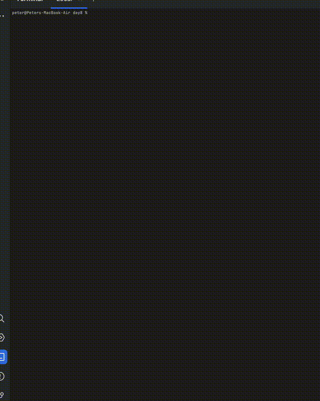

# Day 8

part1 ~40 min. It took some debugging to get the coordinate math correct. NGL, lots of trial and error switching signs.

part2 ~30 min. At first, this seemed like it would be super easy, instead of stopping at one node out in each direction, just iterate the coordinate math until the next coordinate wasn't valid. I had that in place in about 10 minutes. Debugging wasn't getting me anywhere. Finally, I went back to carefully parsing the directions. Part2 changes the rules so that 2 antennas are also automatically antinodes. Even reading it again, it doesn't seem clear without carefully comparing it to the examples.

Added animation

